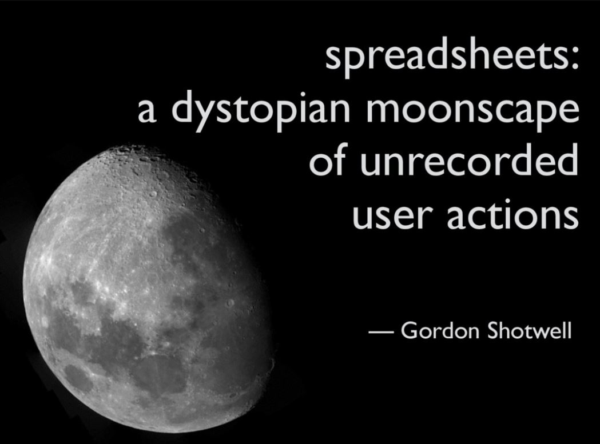

# Statistical & Data Science Practice {#practice}

First, an excellent list of data science resources:

* [Practical Data Science for Stats - a PeerJ Collection](https://peerj.com/collections/50-practicaldatascistats/)

## Introduction

How does one approach a statistics or data science project?

### A theory of data analysis

Roger Peng, 2018-12-11, ["The Role of Theory in Data Analysis"](https://simplystatistics.org/2018/12/11/the-role-of-theory-in-data-analysis/)

Stephanie C. Hicks and Roger Peng, 2019-03-18, ["Elements and Principles of Data Analysis"](https://arxiv.org/abs/1903.07639v1), arXiv.org [@Hicks_Peng_2019]

Stephanie C. Hicks and Roger Peng, 2019-04-26, ["Evaluating the Success of a Data Analysis"](https://arxiv.org/abs/1904.11907), arXiv.org [@Hicks_Peng_2019b]

### The function of data science: solving business problems

Emily Robinson, 2017-09-27, [Managing Business Challenges In Data Science](https://robinsones.github.io/Managing-Business-Challenges-in-Data-Science/)

### Design thinking >> data science context

Roger Peng, 2019-01-09, [How Data Scientists Think - A Mini Case Study](https://simplystatistics.org/2019/01/09/how-data-scientists-think-a-mini-case-study/)

### Opinionated Analysis Development

An over-arching structure of what a project could (or should?) look like can be boiled down into three features: it is

1. Reproducible and auditable

2. Accurate

3. Collaborative

Hilary Parker, 2017-08-30, [Opinionated Analysis Development](https://peerj.com/preprints/3210/)

- some of Hilary Parker's earlier / supporting thoughts on this topic can be found in [her talk "Opinionated Analysis Development" from rstudio::conf2017 (2017-01-14)](https://www.rstudio.com/resources/videos/opinionated-analysis-development/) ([slides alone at slideshare](https://www.slideshare.net/hilaryparker/opinionated-analysis-development)), as well as the slides from her [keynote at EARL SF (2017-06-15)](https://www.slideshare.net/hilaryparker/opinionated-analysis-development-earl-sf-keynote)

## General practice and workflow

**Jenny Bryan on workflow:**

Jenny Bryan, [Project-oriented workflow](https://www.tidyverse.org/articles/2017/12/workflow-vs-script/)

Jenny Bryan, [Ode to the here package](https://github.com/jennybc/here_here)

Wilson G, Bryan J, Cranston K, Kitzes J, Nederbragt L, Teal TK (2017) Good enough practices in scientific computing. PLoS Comput Biol 13(6): e1005510. https://doi.org/10.1371/journal.pcbi.1005510

Jenny Bryan (2017) [Workflow: you should have one](https://speakerdeck.com/jennybc/workflow-you-should-have-one), Keynote talk at EARL London 2017.  

- [Supporting documentation: earl-london-2017-bryan](https://github.com/jennybc/earl-london-2017-bryan#readme)

Kara Woo (2020-02-13) [What They Forgot to Teach You About R at rstudio::conf 2020](https://education.rstudio.com/blog/2020/02/conf20-wtf/)--all the materials from workshop delivered by Kara Woo, Jim Hester, and Jenny Bryan

**other authors**

Keiran Healy, [_The Plain Person's Guide to Plain Text Social Science_](https://kieranhealy.org/files/papers/plain-person-text.pdf) {pdf}

Kass RE, Caffo BS, Davidian M, Meng X-L, Yu B, Reid N (2016) ["Ten Simple Rules for Effective Statistical Practice"](http://journals.plos.org/ploscompbiol/article?id=10.1371%2Fjournal.pcbi.1004961). PLoS Comput Biol 12(6): e1004961. doi:10.1371/journal.pcbi.1004961

Ray Li (2016) ["7 habits of highly effective data analysis"](http://dataconomy.com/2016/02/7-habits-of-highly-effective-data-analysis/). [Dataconomy.com](Dataconomy.com), 2016-02-16.

Noble, William Stafford (2009-07-31) [A Quick Guide to Organizing Computational Biology Projects](https://journals.plos.org/ploscompbiol/article?id=10.1371/journal.pcbi.1000424),  _PLoS Comput Biol_ 5(7): e1000424. 

## Version Control with Git & GitHub

Jenny Bryan, the STAT 545 TAs, Jim Hester [Happy Git and GitHub for the useR](https://happygitwithr.com/)

Mine Çetinkaya-Rundel (2019-07-15) [R & GitHub sitting in a tree...](https://speakerdeck.com/minecr/r-and-github-sitting-in-a-tree-dot-dot-dot)

## R-specific workflow

### Agile

Edwin Thoen, [Agile Data Science with R](https://edwinth.github.io/ADSwR/)

### other

Gabe Becker (2017) [Enhancing reproducibility, comparability and discoverability of results in multi-analyst settings](https://www.slideshare.net/GabrielBecker11/enhancing-reproducibility-comparability-and-discoverability-of-results-in-multianalyst-settings), presentation at EARL (Enterprise Applications of R Language), San Francisco, June 5-7, 2017

* this came to my attention via the Not So Standard Deviations podcast, [episode 40 "It's the CDs All Over Again"](https://www.patreon.com/posts/episode-40-its-11713845) (2017-06-13). The discussion of Gabe Becker's presentation begins at ~13' 10".
  
  - some of Hilary Parker's observations: the topic doesn't get much air time, his talk takes wide view of issues in an organization, trade-offs in collaborative environment (not one analyst); in multi-analyst system (e.g. where both a researcher/biologist and a statistician are both working with the same data) have to reconcile results, there might be parallel studies where results need to be reconciled, >> this creates a need for the data to be created in similar environments. 
  
  - Concerns: reproducibity, comparability,  discoverability (finding the results), and empowerment. Data scientists skew to emppowerment!  But the concerns are in tension--you can increase reproducibility but at cost of empowerment, etc.
  
  - "Most organizations aren't making that judgement call ahead of time...any organization ... if data scientists were there early, you're going to be skewed to agility and high empowerment. Because that's like what we want! ... Data scientists are allergic to process...having any template for results, or ... even having to put things into a specific tool."
  
  - Different systems need different constraints.
  
  - Roger Peng: most organizations don't realize that they are explicitly making these trade-offs, can't maximize all. Have to make a choice, and that's very unsatisfactory for people.

Emily Robinson, [Red Flags in Data Science Interviews](http://hookedondata.org/Red-Flags-in-Data-Science-Interviews/)

<blockquote class="twitter-tweet" data-lang="en">
New blog post, co-written with <a href="https://twitter.com/skyetetra?ref_src=twsrc%5Etfw">/@/skyetetra</a>! 12 red flags to watch out for in data science interviews 🚩<a href="https://t.co/hM2E7I46Da">https://t.co/hM2E7I46Da</a> <a href="https://t.co/jFVA7mmjjU">pic.twitter.com/jFVA7mmjjU</a>
&mdash; Emily Robinson (/@/robinson_es) <a href="https://twitter.com/robinson_es/status/1014164367292747778?ref_src=twsrc%5Etfw">July 3, 2018</a></blockquote>

Noam Ross, [Reproducibility in an Office World: A Brief History of Failures and the Odd Success](https://github.com/noamross/2018-11-06-rladies-talk#reducing-round-trips-making-an-editable-powerpoint-graphic-from-r-with-rvg), presentation to R-Ladies NYC, 2018-11-06

## R packages supporting robust workflow

[**R project workflows**](https://github.com/jdblischak/r-project-workflows#readme): a GitHub repository compiled by jdblichak

* "This is a non-exhaustive list of R code that assists with the workflow of R projects. Some are R packages, others are Git repositories meant to be used as templates, and some are guides. Here "workflow" is broadly defined, and incldues one or more of the following: file organization, dependency management (e.g. like GNU Make), or report generation."

### `{drake}`

CRAN: [drake: A Pipeline Toolkit for Reproducible Computation at Scale](https://CRAN.R-project.org/package=drake) -- "A general-purpose computational engine for data analysis, drake rebuilds intermediate data objects when their dependencies change, and it skips work when the results are already up to date. Not every execution starts from scratch, there is native support for parallel and distributed computing, and completed projects have tangible evidence that they are reproducible. Extensive documentation, from beginner-friendly tutorials to practical examples and more, is available at the reference website <https://docs.ropensci.org/drake/> and the online manual <https://books.ropensci.org/drake/>."

* [The drake R Package User Manual](https://books.ropensci.org/drake/)

### `{janitor}`

[{janitor}](sfirke.github.io/janitor/index.html) -- "has simple functions for examining and cleaning dirty data. It was built with beginning and intermediate R users in mind and is optimized for user-friendliness. Advanced R users can already do everything covered here, but with janitor they can do it faster and save their thinking for the fun stuff."

CRAN: [janitor: Simple Tools for Examining and Cleaning Dirty Data](https://CRAN.R-project.org/package=janitor)

GitHub: [sfirke/janitor](https://github.com/sfirke/janitor)

### `{packrat}`

[{Packrat} is a dependency management system for R](http://rstudio.github.io/packrat/)

CRAN: [packrat: A Dependency Management System for Projects and their R Package Dependencies](https://CRAN.R-project.org/package=packrat)

GitHub: [rstudio/packrat](https://github.com/rstudio/packrat)

** Articles**

Miles McBain (2019-04-09) [A workflow for lightweight R dependency management](https://milesmcbain.xyz/packrat-lite/)

### `{usethis}`

"usethis is a workflow package: it automates repetitive tasks that arise during project setup and development, both for R packages and non-package projects"

CRAN: [usethis: Automate Package and Project Setup](https://CRAN.R-project.org/package=usethis) -- "Automate package and project setup tasks that are otherwise performed manually. This includes setting up unit testing, test coverage, continuous integration, Git, 'GitHub', licenses, 'Rcpp', 'RStudio' projects, and more."

* [usethis 1.5.0](https://www.tidyverse.org/articles/2019/04/usethis-1.5.0/) (April 2019)

***

## Reproducible research

<blockquote class="twitter-tweet" data-lang="en">
This is the future. Show. Your. Damn. Work. <a href="https://t.co/4GWFdXSs17">https://t.co/4GWFdXSs17</a>
&mdash; Chris Albon (/@/chrisalbon) <a href="https://twitter.com/chrisalbon/status/953078784084754433?ref_src=twsrc%5Etfw">January 16, 2018</a></blockquote>

Or:

<blockquote class="twitter-tweet">
Every scientific project will be redone in its entirety about 10-20 times from start to publication. Plan your work flow accordingly, e.g. a piece of R code that takes a data file and produces the analysis and figure/s. Change the data? Just rerun the code.
&mdash; Trevor A. Branch (@TrevorABranch) <a href="https://twitter.com/TrevorABranch/status/1157006269292507136?ref_src=twsrc%5Etfw">August 1, 2019</a></blockquote>  

[reproducibleresearch.net](http://reproducibleresearch.net/)

Emily Riederer, 2019-08-29, [Resource Round-Up: Reproducible Research Edition](https://emilyriederer.netlify.com/post/resource-round-up-reproducible-research-edition/) -- annotated bibliography of some essential resources on the topic.

Justin Kitzes, Daniel Turek, Fatma Deniz (Eds.), [The Practice of Reproducible Research: Case Studies and Lessons from the Data-Intensive Sciences](https://www.practicereproducibleresearch.org/) -- online book with 31 case studies of reproducible research workflows.

Roger Peng (2014-06-06) [The Real Reason Reproducible Research is Important](https://simplystatistics.org/2014/06/06/the-real-reason-reproducible-research-is-important/)

Roger Peng, 2015-06-15, ["The reproducibility crisis in science: A statistical counterattack"](http://onlinelibrary.wiley.com/doi/10.1111/j.1740-9713.2015.00827.x/full), [_Significance_](http://rss.onlinelibrary.wiley.com/hub/journal/10.1111/(ISSN)1740-9713/)

Rich FitzJohn, Matt Pennell, Amy Zanne, Will Cornwell (2014-06-09) [Reproducible research is still a challenge](https://ropensci.org/blog/2014/06/09/reproducibility/) (at [rOpenSci](https://ropensci.org/))

Melissa Assel, MS; Andrew J. Vickers, PhD (2018-02-06) ["Statistical Code for Clinical Research Papers in a High-Impact Specialist Medical Journal"](http://annals.org/aim/article-abstract/2671924/statistical-code-clinical-research-papers-high-impact-specialist-medical-journal), _Annals of Internal Medicine_

V.	Orozco,	C.	Bontemps,	E.	Maigné,	V.	Piguet,	A.	Hofstetter,	A.	Lacroix,		
F.	Levert,	J.M.	Rousselle	(2018-07) ["How	To	Make	A	Pie:	Reproducible	Research	for	Empirical	
Economics	&	Econometrics"](https://www.tse-fr.eu/sites/default/files/TSE/documents/doc/wp/2018/wp_tse_933.pdf)

Jeffrey M. Perkel, ["A toolkit for data transparency takes shape"](https://www.nature.com/articles/d41586-018-05990-5), _Nature_, 2018-08-20.

Daniel Barron (2018-08-13) [How Freely Should Scientists Share Their Data?](https://blogs.scientificamerican.com/observations/how-freely-should-scientists-share-their-data/), _Scientific American_ blog

Karl Broman (2019-02-17) [Collaboratingreproducibly](https://www.biostat.wisc.edu/~kbroman/presentations/rrcollab_aaas2019.pdf), slides for talk given at the AAAS meeting in Washington, DC. (See also  https://github.com/kbroman/Talk_AAAS2019)

### Reproducible research with R

[R for Reproducible Scientific Analysis](https://swcarpentry.github.io/r-novice-gapminder/) -- "an introduction to R for non-programmers using gapminder data", part of the Software Carpentries

Jeremy Anglin, [Reproducible analysis with knitr, R Markdown, and RStudio](https://github.com/jeromyanglim/rmarkdown-rmeetup-2012)
 
Ben Marwick, 20 July 2017, [Reproducible Research Compendia via R packages](https://rawgit.com/benmarwick/Marwick-Berlin-R-users-2017/master/Marwick-Berlin-R-users-2017.html#1), presentation at Berlin R Users

Sharla Gelfand (2020-01-30) [Don't repeat yourself, talk to yourself! Repeated reporting in the R universe](https://sharstudioconf.netlify.com/#1) -- presentation at rstudio::conf 2020

* see also [{redoc}], "a package to enable a two-way R Markdown Microsoft Word workflow. It generates Word documents that can be de-rendered back into R Markdown, retaining edits on the Word document, including tracked changes."

* see also [this list](https://twitter.com/jessenleon/status/1150749113014738946)

### Reproducible data

Greg Finak (2018-09-18) [Building Reproducible Data Packages with DataPackageR](https://ropensci.org/blog/2018/09/18/datapackager/)

Luis Darcy Verde Arregoitia (2018) [Good practices for sharing analysis-ready data in mammalogy and biodiversity research](http://www.italian-journal-of-mammalogy.it/Good-practices-for-sharing-analysis-ready-data-in-mammalogy-and-biodiversity-research,101564,0,2.html), Hystrix It. J. Mamm. 2018;29(2):155–161

### spreadsheets: the anti-reproducible research

Karl Broman and Kara Woo, "Data organization in spreadsheets" [@Broman_Woo_2017].

[Data Organization in Spreadsheets for Social Scientists: Formatting problems](https://datacarpentry.org/spreadsheets-socialsci/02-common-mistakes/index.html) -- DataCarpentry lesson

<blockquote class="twitter-tweet" data-lang="en">
I read &quot;Data analysis without scripting&quot; as &quot;Dystopian moonscape of unrecorded user actions&quot;. I may not be Tableau&#39;s target market. <a href="https://twitter.com/hashtag/rstats?src=hash">#rstats</a>
&mdash; Gordon Shotwell (/@/gshotwell) <a href="https://twitter.com/gshotwell/status/577485681146097664">March 16, 2015</a></blockquote>

Jenny Bryan's [spreadsheets](https://speakerdeck.com/jennybc/spreadsheets) talk given May & June 2016 reframes Shotwell as "Spreadsheets: a dystopian moonscape of unrecorded user actions."

  - live in-person (https://pbs.twimg.com/media/CmDykgRWAAE-_MP.jpg)
  
Ignasi Bartomeus and F Rodriguez-Sanchez,  _Non-reproducible workflows: a horror movie_ :

<blockquote class="twitter-tweet" data-lang="en">
That awesome video on reproducibility with <a href="https://twitter.com/hashtag/rstats?src=hash&amp;ref_src=twsrc%5Etfw">#rstats</a> by <a href="https://twitter.com/ibartomeus?ref_src=twsrc%5Etfw">/@/ibartomeus</a> and <a href="https://twitter.com/frod_san?ref_src=twsrc%5Etfw">/@/frod_san</a> you can find here: <a href="https://t.co/indBflvupv">https://t.co/indBflvupv</a> <a href="https://t.co/QcdonwVTk8">https://t.co/QcdonwVTk8</a>
&mdash; David Smith (/@/revodavid) <a href="https://twitter.com/revodavid/status/917779772385656832?ref_src=twsrc%5Etfw">October 10, 2017</a></blockquote>

    - with more at [Reproducibilidad](http://ecoinfaeet.github.io/2016/07/06/reproducibilidad/)

Gordon Shotwell, 2017-02-02, [R for Excel Users](http://blog.shotwell.ca/post/r_for_excel_users/)

Luis A. Apiolaza, 2017-11-11, [Reducing friction in R to avoid Excel](http://www.quantumforest.com/2017/11/reducing-friction-to-avoid-excel/)

## Collaboration

Amit Bhattacharyya, 2017-11-01, [Become a Better Statistician by Actively Collaborating](http://magazine.amstat.org/blog/2017/11/01/collaborating/) (at [_Amstatnews_](http://magazine.amstat.org/))

Peter Seibel, 2017-11-19, [Repo style wars: mono vs multi](http://www.gigamonkeys.com/mono-vs-multi/)

## Data Informed or Data Driven? Data Science at Work

Ricardo Bion, Robert Chang, and Jason Goodman (2017-08-23) [How R Helps Airbnb Make the Most of Its Data](https://peerj.com/preprints/3182.pdf)

[The Stitch Fix Algorithms Tour](http://algorithms-tour.stitchfix.com/)

Behavioural Insights Team (UK), 2017-12-14, [Using Data Science in Policy](http://www.behaviouralinsights.co.uk/publications/using-data-science-in-policy/)

## Agile practice

[Agile Scrum Guide](http://agile-guide.pathfinder.bcgov/), BC Government DevEx

## Data Quality & Context Compatibility

Or, do your data really mean what you hope they do?

Jacob Harris (2014) ["Distrust your data"](https://source.opennews.org/en-US/learning/distrust-your-data/), 2014-05-24.

Roger Peng (2018) [Context Compatibility in Data Analysis](https://simplystatistics.org/2018/05/24/context-compatibility-in-data-analysis/), 2018-05-30

## File storage and naming conventions

[Sustainability of Digital Formats: Planning for Library of Congress Collections](http://www.digitalpreservation.gov/formats/index.shtml)

Jenny Bryan, [naming things](http://www2.stat.duke.edu/~rcs46/lectures_2015/01-markdown-git/slides/naming-slides/naming-slides.pdf),
Reproducible Science Workshop, 2015

***

## Data practice

Karl Broman, [data organization](http://kbroman.org/dataorg/)

Karl Broman and Kara Woo, "Data organization in spreadsheets" [@Broman_Woo_2017].

<blockquote class="twitter-tweet" data-lang="en">
For data scientists thinking about biases in your data, don&#39;t start by reading the computer science literature. Read epidemiology instead. You need data street smarts, not mathy book smarts. Otherwise the first data set you meet is going to beat you up and take your lunch money!
&mdash; Kareem ❤️ statistics (/@/kareem_carr) <a href="https://twitter.com/kareem_carr/status/1094993530097991680?ref_src=twsrc%5Etfw">February 11, 2019</a></blockquote>

### Versioned data

Daniel Falster, Richard G FitzJohn, Matthew W. Pennell, William K. Cornwell (2017-11-10) [Versioned data: why it is needed and how it can be achieved (easily and cheaply)](https://peerj.com/preprints/3401/)

***

## Coding practice

<blockquote class="twitter-tweet">
Why writing readable code matters:  It’s like the turn signals in your car: Even though you (the driver) might know where you’re going, you still need to make your intentions clear to everyone else around you.<a href="https://twitter.com/hashtag/DevDiscuss?src=hash&amp;ref_src=twsrc%5Etfw">#DevDiscuss</a> <a href="https://t.co/5GKrYaEz41">https://t.co/5GKrYaEz41</a>
&mdash; Olivia Liddell (/@oliravi) <a href="https://twitter.com/oliravi/status/1181741102447116288?ref_src=twsrc%5Etfw">October 9, 2019</a></blockquote>  

[Coding etiquette](https://ourcodingclub.github.io/2017/04/25/etiquette.html), a guide to writing clear, informative and easy-to-use #RStats code by /@/CodingClub 

Joel Lee, 2017-12=22, [The Weirdest Programming Principles You’ve Never Heard Of](https://www.makeuseof.com/tag/weird-programming-principles/)

### Style guides for code

Hadley Wickham, [The tidyverse style guide](https://style.tidyverse.org/)

Hadley Wickham, ["Style Guide"](http://adv-r.had.co.nz/Style.html) chapter from [_Advanced R_](http://adv-r.had.co.nz/)

Henrik Bengtsson, [_R Coding Conventions (RCC) - a draft](https://docs.google.com/document/d/1esDVxyWvH8AsX-VJa-8oqWaHLs4stGlIbk8kLc5VlII/edit) (2009)

[_Google's R Style Guide_](https://google.github.io/styleguide/Rguide.xml)

### Version control

Jenny Bryan and the STAT 545 TAs, [_Happy Git and GitHub for the useR_](http://happygitwithr.com/)

John D. Blischak, Emily R. Davenport, Greg Wilson (2016-01-19) ["A Quick Introduction to Version Control with Git and GitHub"](http://journals.plos.org/ploscompbiol/article?id=10.1371/journal.pcbi.1004668), _PLoS Computational Biology_.

### Documentation

<blockquote class="twitter-tweet" data-lang="en">
&quot;Writing documentation is all about making future you remember things that present you knows future you will forget&quot; -- <a href="https://twitter.com/data_stephanie?ref_src=twsrc%5Etfw">/@/data_stephanie</a> <a href="https://twitter.com/hashtag/rstats?src=hash&amp;ref_src=twsrc%5Etfw">#rstats</a> <a href="https://twitter.com/hashtag/Rladies?src=hash&amp;ref_src=twsrc%5Etfw">#Rladies</a>
&mdash; R-Ladies Chicago (/@/RLadiesChicago) <a href="https://twitter.com/RLadiesChicago/status/963576859152744456?ref_src=twsrc%5Etfw">February 14, 2018</a></blockquote>

Sébastien Rochette, 2019-07-10, [Rmd first: When development starts with documentation](https://www.r-bloggers.com/rmd-first-when-development-starts-with-documentation/)

* see also [RMarkdown]
  

### Literate programming

The practice of explaining the program logic in a natural language"; it goes beyond what might be called "documentation". In the world of R, the RMarkdown functionality within [RStudio](https://www.rstudio.com/products/rstudio/), including [R notebooks](http://rmarkdown.rstudio.com/r_notebooks.html), is a way to program in this manner.

The concept was introduced by Donald Knuth in 1984; the original article is
> Knuth, Donald E. (1984). ["Literate Programming"](http://www.literateprogramming.com/knuthweb.pdf) (PDF). _The Computer Journal_. British Computer Society. 27 (2): 97–111. 

* [literateprogramming.com](http://www.literateprogramming.com/)

* [Wikipedia entry](https://en.wikipedia.org/wiki/Literate_programming)

### Functions in R

Colin Fay, [Playing with R, infix functions, and pizza ](http://colinfay.me/playing-r-infix-functions/)

### Naming variables

"There are only two hard things in Computer Science: cache invalidation and naming things."
-- Phil Karlton

Andy Lester, ["The World's Two Worst Variable Names"](http://archive.oreilly.com/pub/post/the_worlds_two_worst_variable.html)

### Clean coding 

Robert C. Martin, 2008, _Clean Code: A Handbook of Agile Software Development_, Prentice Hall.

Robert C. Martin, 2011, _The Clean Coder: A Code of Conduct for Professional Programmers_, Prentice Hall.

### Further reading

Aimee Gott, 2015-07-16, [Developing a R Validation Framework](https://www.baselr.org/wp-content/uploads/sites/4/presentations/BaselR_-_Formalising_R_Development_-_Aimee_Gott_-_20150716.pdf), BaselR

Dani Marillas, 2017-01-25, ["Don’t document your code. Code your documentation."](https://dev.to/raddikx/dont-document-your-code-code-your-documentation)

## General research practice

<blockquote class="twitter-tweet" data-lang="en">
I didn&#39;t think my &quot;start-up&quot; document for my grad students (the resources I wish *I* had when I started a PhD) would prove to be so popular, so I figured I would share them here. So, here&#39;s what I&#39;ve compiled so far. <a href="https://twitter.com/hashtag/hiddencurriculum?src=hash&amp;ref_src=twsrc%5Etfw">#hiddencurriculum</a> 1/12
&mdash; Matt Hauer (/@/thehauer) <a href="https://twitter.com/thehauer/status/1021179403680862218?ref_src=twsrc%5Etfw">July 22, 2018</a></blockquote>

***

### things that are no doubt useful and/or interesting but don't really fit anywhere in the existing typology

Louisa Smith , [epi quals study calendar](https://docs.google.com/spreadsheets/d/1HyyfGZhAzVtyJ-tcuBWxKbmsaJ3uMkuXyfzAUYsfemw/edit#gid=0)

* https://twitter.com/louisahsmith/status/1081955868864901120

***

